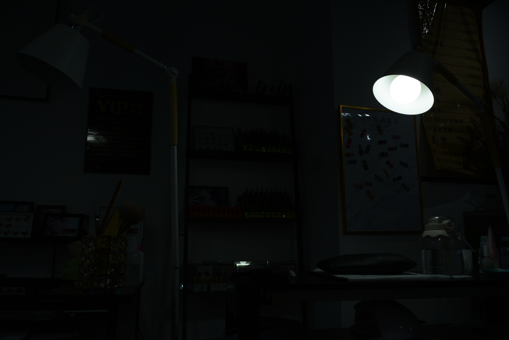

# RetinexRWKV Introduction
### RetinexRWKV is an innovative image processing method whose core component is Retinexformer, which utilizes advanced RWKV TimeMix technology. RWKV TimeMix is a unique mechanism for time series mixing, combining information in the time dimension deeply to enhance the model's adaptability in complex environments. This technology not only strengthens Retinexformer’s ability to process image details but also excels in light restoration and color recovery.

### Through RWKV TimeMix technology, RetinexRWKV efficiently captures temporal dynamics within images, providing users with more realistic and natural image reconstruction. This makes RetinexRWKV highly advantageous in image enhancement, night scene processing, and other scenarios requiring dynamic adjustments.

# Result
<table>
<tr>
<td>

</td>
<td>

</td>
</tr>
</table>

<table>
<tr>
<td>

</td>
<td>

</td>
</tr>
</table>

<table>
<tr>
<td>

</td>
<td>

</td>
</tr>
</table>


## 1. Create Environment
- Use Nvidia cuda with Python 3.12 
```sh
pip install torch torchvision torchaudio
pip install rwkv-fla[cuda]
pip install -r requirements.txt
```
- Use AMD Radeon Rocm with Python 3.12 
```sh
pip install torch torchvision torchaudio --index-url https://download.pytorch.org/whl/rocm6.2.4
pip install rwkv-fla[rocm]
pip install -r requirements.txt
```
## 2. Prepare Dataset
- modiffy the Dataset Path in ```./config.json```

## 3. Testing
- modiffy the Model Weight Path in ./test.py Line 87 88 89
- Recommend use ./best_model_nfeat_16.pth for tset
```sh
python ./test.py 
```


## 4. Training 
- We Training on AMD Radeon Rro with 48GB VRAM Use PyTorch version: 2.6.0+rocm6.2.4
### Params Setting
- modiffy the params in ```./config.json```

### Go For Training
- modiffy the Dataset Path in ```./config.json``` First
```sh
python train.py 
```